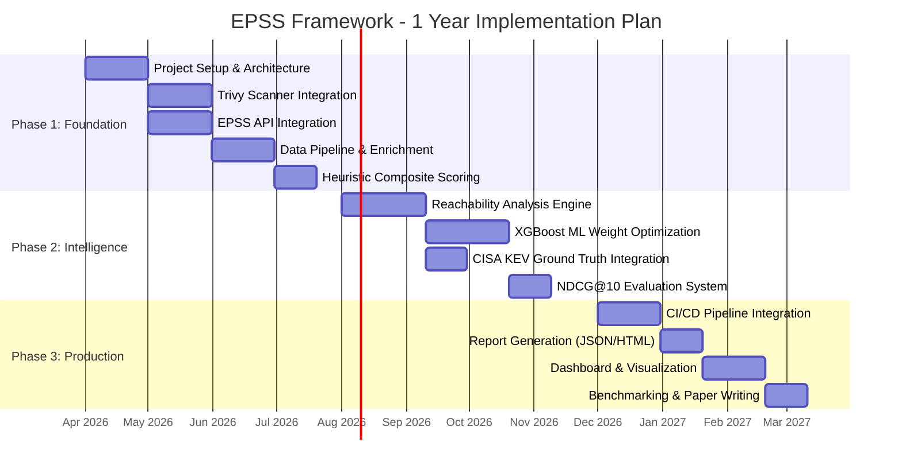

# 🛡️ EPSS-Augmented CVE Prioritization Framework
## Complete 1-Year Implementation Plan

> [!IMPORTANT]
> **Project Goal:** Build an end-to-end framework that scans Docker container images for vulnerabilities, enriches them with EPSS exploit probability scores and reachability analysis, computes a composite risk score (CVSS + EPSS + Reachability), and integrates into CI/CD pipelines — reducing alert fatigue and enabling faster remediation.

---

## 📅 Timeline Overview



---

## 🔷 PHASE 1: Foundation & Data Pipeline (Months 1–4)
**April 2026 – July 2026**

> **Objective:** Establish the core scanning, enrichment, and heuristic scoring pipeline.

### 📋 Task 1.1: Project Setup & Architecture Design
**Duration:** Weeks 1–4 | **Priority:** 🔴 Critical
**Status:** ✅ Completed

- [ ] **1.1.1 Repository Initialization**
  - [ ] Initialize Git repository with proper `.gitignore`
  - [ ] Set up Python project with `pyproject.toml` (Python 3.11+)
  - [ ] Create virtual environment and dependency management (Poetry/pip-tools)
  - [ ] Set up pre-commit hooks (black, ruff, mypy)
- [ ] **1.1.2 Project Structure Design**
  - [ ] Design modular package structure:
    ```
    epss_framework/
    ├── scanner/          # Trivy integration
    ├── enrichment/       # EPSS API client
    ├── reachability/     # Static analysis engine
    ├── scoring/          # Composite scoring logic
    ├── ml/               # XGBoost model training
    ├── reports/          # JSON/HTML report generation
    ├── pipeline/         # CI/CD integration
    ├── evaluation/       # NDCG@10 metrics
    ├── config/           # Configuration management
    ├── utils/            # Shared utilities
    └── tests/            # Unit & integration tests
    ```
  - [ ] Define configuration schema (YAML-based)
  - [ ] Create Docker development environment (`Dockerfile` + `docker-compose.yml`)
- [ ] **1.1.3 Documentation Foundation**
  - [ ] Write `README.md` with project overview, architecture, and setup instructions
  - [ ] Create `CONTRIBUTING.md` guidelines
  - [ ] Set up Sphinx/MkDocs documentation site
  - [ ] Document API contracts between modules
- [ ] **1.1.4 CI/CD for Development**
  - [ ] Set up GitHub Actions for linting, testing, and type checking
  - [ ] Configure code coverage with pytest-cov (target: 80%+)
  - [ ] Set up automated dependency vulnerability scanning

---

### 📋 Task 1.2: Trivy Scanner Integration Module
**Duration:** Weeks 3–6 | **Priority:** 🔴 Critical
**Status:** ✅ Completed

- [ ] **1.2.1 Trivy Installation & Configuration**
  - [ ] Automate Trivy binary installation (version pinning)
  - [ ] Create Trivy configuration file (`trivy.yaml`) with custom policies
  - [ ] Support multiple output formats (JSON, Table, SARIF)
  - [ ] Configure vulnerability database auto-update mechanism
- [ ] **1.2.2 Scanner Core Implementation**
  - [ ] Implement `ImageScanner` class with async scanning support
  - [ ] Parse Trivy JSON output into structured Python objects (`ScanResult`, `Vulnerability`)
  - [ ] Handle scanning of:
    - [ ] Local Docker images
    - [ ] Remote registry images (Docker Hub, ECR, GCR, ACR)
    - [ ] Tar archives
    - [ ] Filesystem paths
  - [ ] Implement scan caching to avoid redundant scans
  - [ ] Add timeout and retry logic for large images
- [ ] **1.2.3 CVE Data Extraction**
  - [ ] Extract CVE ID, CVSS v3.1 base score, severity level
  - [ ] Extract affected package name, version, and fixed version
  - [ ] Extract vulnerability description and references
  - [ ] Map CVEs to CWE categories
  - [ ] Handle edge cases: CVEs without CVSS scores, disputed CVEs
- [ ] **1.2.4 Scanner Testing**
  - [ ] Unit tests for JSON parsing logic
  - [ ] Integration tests with known vulnerable images (e.g., `vulnerables/web-dvwa`)
  - [ ] Performance benchmarks for scan time vs. image size
  - [ ] Test with 10+ popular base images (alpine, ubuntu, node, python, nginx, etc.)

---

### 📋 Task 1.3: EPSS Score Integration Module
**Duration:** Weeks 3–6 | **Priority:** 🔴 Critical
**Status:** ✅ Completed

- [ ] **1.3.1 FIRST EPSS API Client**
  - [ ] Implement async HTTP client for FIRST EPSS API (`https://api.first.org/data/v1/epss`)
  - [ ] Support batch CVE queries (up to 100 CVEs per request)
  - [ ] Implement request rate limiting (respect API rate limits)
  - [ ] Add response validation and error handling
  - [ ] Implement local caching (SQLite/Redis) with configurable TTL (default: 24h)
- [ ] **1.3.2 EPSS Data Models**
  - [ ] Create `EPSSScore` dataclass with: CVE ID, EPSS score (0-1), percentile, model version, date
  - [ ] Implement score history tracking for trend analysis
  - [ ] Handle missing EPSS scores (fallback strategies)
- [ ] **1.3.3 Bulk EPSS Data Download**
  - [ ] Implement daily EPSS CSV bulk download (`https://epss.cyentia.com/epss_scores-YYYY-MM-DD.csv.gz`)
  - [ ] Build local EPSS database for offline/fast lookups
  - [ ] Implement incremental update mechanism
  - [ ] Schedule automated daily sync
- [ ] **1.3.4 EPSS Integration Testing**
  - [ ] Unit tests with mocked API responses
  - [ ] Integration tests against live FIRST API
  - [ ] Test cache hit/miss scenarios
  - [ ] Validate score accuracy against official EPSS data

---

### 📋 Task 1.4: Data Enrichment Pipeline
**Duration:** Weeks 7–10 | **Priority:** 🔴 Critical
**Status:** ✅ Completed

- [ ] **1.4.1 Data Fusion Engine**
  - [ ] Implement `EnrichmentPipeline` class that orchestrates Scanner → EPSS → Merge
  - [ ] Create unified `EnrichedVulnerability` data model:
    ```python
    @dataclass
    class EnrichedVulnerability:
        cve_id: str
        cvss_score: float          # 0-10
        cvss_severity: str         # LOW/MEDIUM/HIGH/CRITICAL
        epss_score: float          # 0-1
        epss_percentile: float     # 0-1
        affected_package: str
        installed_version: str
        fixed_version: Optional[str]
        reachability: float        # 0 or 1 (Phase 2)
        composite_score: float     # Computed
        cwe_id: Optional[str]
        description: str
        references: List[str]
    ```
  - [ ] Implement data validation and sanitization
  - [ ] Handle CVEs found by scanner but missing from EPSS database
- [ ] **1.4.2 Data Storage Layer**
  - [ ] Design SQLite schema for scan results persistence
  - [ ] Implement scan history and trend tracking
  - [ ] Add data export capabilities (CSV, JSON, Parquet)
  - [ ] Implement data retention policies
- [ ] **1.4.3 Pipeline Orchestration**
  - [ ] Implement async pipeline execution with progress reporting
  - [ ] Add logging with structured JSON output
  - [ ] Implement graceful error handling and partial result support
  - [ ] Create CLI interface using Click/Typer:
    ```bash
    epss-triage scan <image> --output json --format enriched
    epss-triage enrich <scan-result.json> --epss-source api
    epss-triage score <enriched-result.json> --weights heuristic
    ```
- [ ] **1.4.4 Pipeline Testing**
  - [ ] End-to-end integration test: scan → enrich → output
  - [ ] Test with 20+ real-world container images
  - [ ] Benchmark pipeline throughput (images/hour)
  - [ ] Test failure scenarios (API down, corrupted data, etc.)

---

### 📋 Task 1.5: Heuristic Composite Risk Scoring (Phase 1 Scoring)
**Duration:** Weeks 9–12 | **Priority:** 🟡 High
**Status:** ✅ Completed

- [ ] **1.5.1 Heuristic Weight Assignment**
  - [ ] Implement configurable weighted scoring formula:
    ```
    CompositeScore = w1 × normalize(CVSS) + w2 × EPSS + w3 × Reachability
    ```
  - [ ] Default heuristic weights: `w1=0.4, w2=0.4, w3=0.2`
  - [ ] Implement CVSS normalization (0-10 → 0-1)
  - [ ] Support custom weight profiles via configuration
- [ ] **1.5.2 Scoring Engine**
  - [ ] Implement `CompositeScorer` class with pluggable weight strategies
  - [ ] Add score bucketing: CRITICAL (≥0.8), HIGH (≥0.6), MEDIUM (≥0.4), LOW (<0.4)
  - [ ] Implement vulnerability ranking with tie-breaking logic
  - [ ] Generate score explanation for each CVE (which factor contributed most)
- [ ] **1.5.3 Baseline Comparison**
  - [ ] Implement CVSS-only ranking as baseline
  - [ ] Compare CVSS-only vs. CVSS+EPSS ranking differences
  - [ ] Identify cases where EPSS significantly re-ranks CVEs
  - [ ] Generate comparison statistics and visualizations
- [ ] **1.5.4 Scoring Validation**
  - [ ] Unit tests for scoring formula correctness
  - [ ] Edge case tests (CVSS=0, EPSS=0, all equal scores)
  - [ ] Validate ranking stability across multiple runs
  - [ ] Cross-reference high-composite-score CVEs against known exploited CVEs

---

### 🎯 Phase 1 Deliverables
| Deliverable | Format | Status |
|---|---|---|
| Working Trivy scanner integration | Python module | ✅ |
| EPSS API client with caching | Python module | ✅ |
| Data enrichment pipeline | Python module | ✅ |
| Heuristic composite scoring | Python module | ✅ |
| CLI tool (`epss-triage`) | CLI application | ✅ |
| Unit & integration tests (80%+ coverage) | pytest suite | ✅ (95%) |
| Technical documentation | MkDocs site | ✅ |
| Phase 1 demo with 10+ images scanned | Demo report | ✅ |

---

## 🔶 PHASE 2: Intelligence & ML Optimization (Months 5–8)
**August 2026 – November 2026**

> **Objective:** Add reachability analysis, ML-optimized scoring with XGBoost, and formal evaluation metrics.

### 📋 Task 2.1: Reachability Analysis Engine
**Duration:** Weeks 1–6 | **Priority:** 🔴 Critical

- [ ] **2.1.1 Container Filesystem Inspection**
  - [ ] Implement container image layer extraction and filesystem mounting
  - [ ] Build file inventory of installed packages and libraries
  - [ ] Map CVE-affected packages to actual filesystem paths
  - [ ] Detect package manager metadata (dpkg, rpm, apk, pip, npm, etc.)
- [ ] **2.1.2 Static Dependency Analysis**
  - [ ] Implement import/dependency graph construction for:
    - [ ] Python (ast module, importlib)
    - [ ] Node.js (require/import resolution)
    - [ ] Java (classpath analysis)
    - [ ] Go (module dependency graph)
  - [ ] Determine if vulnerable packages are in the application's dependency chain
  - [ ] Distinguish direct vs. transitive dependencies
- [ ] **2.1.3 Reachability Score Computation**
  - [ ] Binary reachability: 1 (reachable) or 0 (not reachable)
  - [ ] Consider extending to continuous score (0-1) based on:
    - [ ] Call depth to vulnerable function
    - [ ] Number of call paths reaching the vulnerability
    - [ ] Whether the vulnerable code path is in a critical execution flow
  - [ ] Implement configurable reachability threshold
- [ ] **2.1.4 Reachability Testing**
  - [ ] Create test container images with known reachable/unreachable vulnerabilities
  - [ ] Validate reachability detection accuracy on test images
  - [ ] Performance benchmarks for analysis time
  - [ ] Document false positive/negative rates

---

### 📋 Task 2.2: CISA KEV Ground Truth Integration
**Duration:** Weeks 3–5 | **Priority:** 🔴 Critical

- [ ] **2.2.1 KEV Catalog Ingestion**
  - [ ] Implement automated download of CISA KEV catalog (JSON feed)
  - [ ] Parse and store KEV data: CVE ID, vendor, product, date added, due date
  - [ ] Schedule daily sync with KEV API
  - [ ] Build local KEV database with search capabilities
- [ ] **2.2.2 Ground Truth Label Generation**
  - [ ] Label CVEs as "exploited" (in KEV) or "not-known-exploited" (not in KEV)
  - [ ] Create training dataset: `(CVSS, EPSS, Reachability) → KEV_label`
  - [ ] Handle class imbalance (KEV contains ~1100 CVEs vs. 200k+ total CVEs)
  - [ ] Implement temporal train/test split to avoid data leakage
- [ ] **2.2.3 Dataset Analysis**
  - [ ] Analyze KEV CVE distribution by CVSS score
  - [ ] Analyze KEV CVE distribution by EPSS score
  - [ ] Identify patterns: what makes a CVE end up in KEV?
  - [ ] Generate exploratory data analysis report

---

### 📋 Task 2.3: XGBoost ML Weight Optimization
**Duration:** Weeks 5–10 | **Priority:** 🔴 Critical

- [ ] **2.3.1 Feature Engineering**
  - [ ] Define feature vector:
    - [ ] CVSS base score (continuous, 0-10)
    - [ ] CVSS impact subscore
    - [ ] CVSS exploitability subscore
    - [ ] EPSS score (continuous, 0-1)
    - [ ] EPSS percentile
    - [ ] Reachability score (binary/continuous)
    - [ ] CVE age (days since publication)
    - [ ] CWE category (one-hot encoded)
    - [ ] Package ecosystem (npm, pip, etc.)
  - [ ] Implement feature normalization and scaling
  - [ ] Perform feature importance analysis
- [ ] **2.3.2 Model Training**
  - [ ] Implement XGBoost classifier/ranker for vulnerability prioritization
  - [ ] Hyperparameter tuning using Optuna/GridSearch:
    - [ ] `max_depth`, `learning_rate`, `n_estimators`, `subsample`
    - [ ] `scale_pos_weight` for class imbalance
  - [ ] Implement k-fold cross-validation (k=5)
  - [ ] Train on CISA KEV labeled dataset
  - [ ] Compare with baseline models: Logistic Regression, Random Forest
- [ ] **2.3.3 Weight Extraction & Integration**
  - [ ] Extract learned feature importances as optimized weights
  - [ ] Map XGBoost outputs back to composite scoring weights (w1, w2, w3)
  - [ ] Implement model versioning and experiment tracking (MLflow/Weights & Biases)
  - [ ] Create model serialization/loading pipeline
- [ ] **2.3.4 Model Evaluation**
  - [ ] Classification metrics: Precision, Recall, F1-Score, AUC-ROC
  - [ ] Compare ML-optimized vs. heuristic weights
  - [ ] Analyze misclassified CVEs for patterns
  - [ ] Document model performance and limitations

---

### 📋 Task 2.4: NDCG@10 Evaluation System
**Duration:** Weeks 9–12 | **Priority:** 🟡 High

- [ ] **2.4.1 Information Retrieval Evaluation Framework**
  - [ ] Implement NDCG@K (Normalized Discounted Cumulative Gain) metric
  - [ ] Implement additional ranking metrics: MAP@K, Precision@K, Recall@K
  - [ ] Define relevance grades based on KEV status and exploit severity
  - [ ] Create standardized evaluation datasets
- [ ] **2.4.2 Benchmarking Suite**
  - [ ] Benchmark: CVSS-only ranking vs. CVSS+EPSS vs. Full Composite
  - [ ] Benchmark: Heuristic weights vs. ML-optimized weights
  - [ ] Statistical significance testing (paired t-test, Wilcoxon signed-rank)
  - [ ] Generate benchmark result tables and plots
- [ ] **2.4.3 Evaluation Report Generation**
  - [ ] Automated benchmark report generation (LaTeX/Markdown)
  - [ ] Ranking comparison visualizations (heatmaps, rank correlation plots)
  - [ ] Per-image and aggregate performance analysis
  - [ ] Create reproducible evaluation scripts

---

### 🎯 Phase 2 Deliverables
| Deliverable | Format | Status |
|---|---|---|
| Reachability analysis engine | Python module | ⬜ |
| CISA KEV integration & labeled dataset | Python module + dataset | ⬜ |
| Trained XGBoost model | Serialized model (.pkl) | ⬜ |
| ML vs. Heuristic comparison report | Evaluation report | ⬜ |
| NDCG@10 evaluation framework | Python module | ⬜ |
| Updated CLI with ML scoring | CLI application | ⬜ |
| Phase 2 demo & benchmarks | Demo report | ⬜ |

---

## 🟢 PHASE 3: Production & Publication (Months 9–12)
**December 2026 – March 2027**

> **Objective:** Productionize the framework with CI/CD integration, rich reports, web dashboard, and prepare research publication.

### 📋 Task 3.1: CI/CD Pipeline Integration
**Duration:** Weeks 1–4 | **Priority:** 🔴 Critical

- [ ] **3.1.1 GitHub Actions Integration**
  - [ ] Create reusable GitHub Action for EPSS-augmented scanning
  - [ ] Implement configurable policy gates (fail build if composite score > threshold)
  - [ ] Support PR comment annotations with scan results
  - [ ] Implement scan result caching between pipeline runs
- [ ] **3.1.2 GitLab CI Integration**
  - [ ] Create `.gitlab-ci.yml` template with scanning stages
  - [ ] Implement GitLab Security Dashboard integration (SAST report format)
  - [ ] Support merge request annotations
- [ ] **3.1.3 Jenkins Integration**
  - [ ] Create Jenkins shared library for EPSS scanning
  - [ ] Implement pipeline step with configurable thresholds
  - [ ] Support Jenkins Security Warnings plugin integration
- [ ] **3.1.4 Generic CI/CD Support**
  - [ ] Create Docker image with all dependencies pre-installed
  - [ ] Implement webhooks for scan result notifications (Slack, Teams, email)
  - [ ] Support SARIF output format for IDE integration
  - [ ] Create Helm chart for Kubernetes-native scanning

---

### 📋 Task 3.2: Report Generation Engine
**Duration:** Weeks 3–6 | **Priority:** 🔴 Critical

- [ ] **3.2.1 JSON Report Generator**
  - [ ] Structured JSON output with full vulnerability details
  - [ ] Include scan metadata (image, timestamp, framework version)
  - [ ] Implement JSON Schema for report validation
  - [ ] Support SARIF and CycloneDX SBOM formats
- [ ] **3.2.2 HTML Report Generator**
  - [ ] Design responsive, professional HTML report template
  - [ ] Include interactive vulnerability table with sorting/filtering
  - [ ] Score distribution visualizations (charts using Chart.js)
  - [ ] Executive summary section with key metrics
  - [ ] Vulnerability detail cards with CVSS/EPSS breakdown
  - [ ] Trend analysis section (if historical data available)
- [ ] **3.2.3 PDF Report Generator**
  - [ ] Generate printable PDF reports from HTML templates
  - [ ] Include cover page, table of contents, executive summary
  - [ ] Appendix with full CVE details
- [ ] **3.2.4 Report Customization**
  - [ ] Support custom report templates (Jinja2)
  - [ ] Configurable report sections (include/exclude)
  - [ ] Support multiple output languages (i18n)
  - [ ] Implement report diffing (compare two scan reports)

---

### 📋 Task 3.3: Web Dashboard & Visualization
**Duration:** Weeks 5–10 | **Priority:** 🟡 High

- [ ] **3.3.1 Dashboard Backend (FastAPI)**
  - [ ] REST API for scan results, trends, and image management
  - [ ] WebSocket support for real-time scan progress
  - [ ] Authentication and authorization (API keys, OAuth2)
  - [ ] SQLite/PostgreSQL persistence layer
- [ ] **3.3.2 Dashboard Frontend**
  - [ ] Image portfolio view (all scanned images with latest scores)
  - [ ] Vulnerability drill-down with CVSS/EPSS/Reachability breakdown
  - [ ] Interactive risk heatmap (CVSS vs. EPSS scatter plot)
  - [ ] Score trend charts over time
  - [ ] Alert fatigue reduction metrics (CVEs filtered by composite scoring)
  - [ ] Comparison view: CVSS-only vs. Composite ranking
- [ ] **3.3.3 Notification System**
  - [ ] New critical vulnerability alerts
  - [ ] EPSS score spike detection and alerting
  - [ ] Weekly/daily scan summary digest
  - [ ] Integration with PagerDuty, Slack, Microsoft Teams

---

### 📋 Task 3.4: Benchmarking, Paper Writing & Publication
**Duration:** Weeks 8–14 | **Priority:** 🟡 High

- [ ] **3.4.1 Comprehensive Benchmarking**
  - [ ] Scan 50+ popular Docker Hub images (official images)
  - [ ] Compare framework ranking vs. Trivy-only, Docker Scout, Grype
  - [ ] Measure alert fatigue reduction (% of CVEs deprioritized correctly)
  - [ ] Performance benchmarks: scan time, memory usage, API calls
  - [ ] Generate publication-ready tables and figures
- [ ] **3.4.2 Research Paper Writing**
  - [ ] Write IEEE/ACM format paper with sections:
    - [ ] Abstract, Introduction, Related Work
    - [ ] System Architecture & Methodology
    - [ ] Implementation Details
    - [ ] Experimental Results & Evaluation
    - [ ] Discussion & Limitations
    - [ ] Conclusion & Future Work
  - [ ] Create publication-quality figures (architecture diagram, results plots)
  - [ ] Write supplementary materials (appendix, code availability)
- [ ] **3.4.3 Open Source Release**
  - [ ] Clean up codebase for public release
  - [ ] Write comprehensive README with badges and examples
  - [ ] Create PyPI package for easy installation
  - [ ] Set up GitHub Pages documentation site
  - [ ] Create demo video/screencast
  - [ ] Submit to relevant security conferences/journals

---

### 🎯 Phase 3 Deliverables
| Deliverable | Format | Status |
|---|---|---|
| CI/CD integration (GitHub Actions, GitLab) | Pipeline configs | ⬜ |
| JSON/HTML/PDF report generators | Python modules | ⬜ |
| Web dashboard with visualizations | FastAPI + Frontend | ⬜ |
| 50+ image benchmark results | Evaluation report | ⬜ |
| Research paper draft | IEEE/ACM format | ⬜ |
| PyPI package release | Published package | ⬜ |
| Open source repository | GitHub public repo | ⬜ |

---

## 📊 Overall Progress Tracker

| Phase | Timeline | Tasks | Status |
|---|---|---|---|
| **Phase 1:** Foundation & Data Pipeline | Apr–Jul 2026 | 5 major tasks, 20 subtask groups | ✅ Completed |
| **Phase 2:** Intelligence & ML | Aug–Nov 2026 | 4 major tasks, 16 subtask groups | ⬜ Not Started |
| **Phase 3:** Production & Publication | Dec 2026–Mar 2027 | 4 major tasks, 16 subtask groups | ⬜ Not Started |

---

## 🔧 Technology Stack

| Component | Technology |
|---|---|
| **Language** | Python 3.11+ |
| **Scanner** | Trivy (via subprocess/API) |
| **EPSS Data** | FIRST EPSS API + Bulk CSV |
| **Ground Truth** | CISA KEV Catalog |
| **ML Framework** | XGBoost, scikit-learn |
| **Evaluation** | NDCG@10, MAP@K, AUC-ROC |
| **CLI** | Typer / Click |
| **Web Framework** | FastAPI |
| **Frontend** | HTML/CSS/JS + Chart.js |
| **Database** | SQLite (dev) / PostgreSQL (prod) |
| **CI/CD** | GitHub Actions |
| **Documentation** | MkDocs Material |
| **Testing** | pytest + pytest-cov + pytest-asyncio |
| **Experiment Tracking** | MLflow |
| **Containerization** | Docker + docker-compose |
